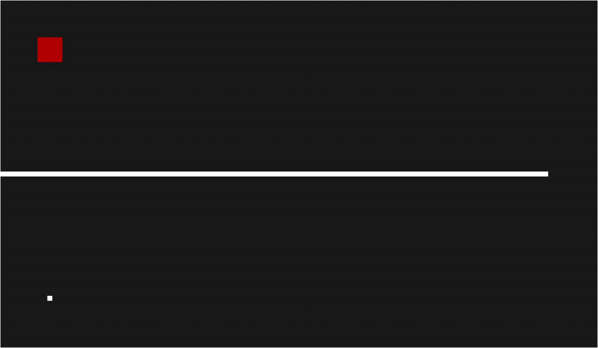

# Mini golf 2D
This project was creates as a part of the _Computer Graphics_ course at _Reykjavik University_. It's a mini golf game with 5 levels. You advance to the next level by hitting the ball into the red box doing this in the final 5 level will restart the game. The strength and direction of the shot can be controlled by holding down the left mouse button. 

## Example of the first two levels

## Installation and running the game
This game uses PyOpenGL and pygame for rendering and PyGLM for beautiful math. You can use `pip install -r requirements.txt` to install these requirements

Use `python src/main.py` to run the game.
